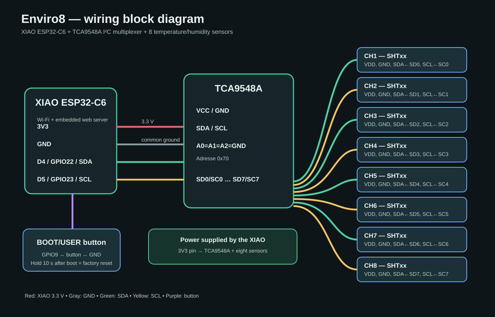
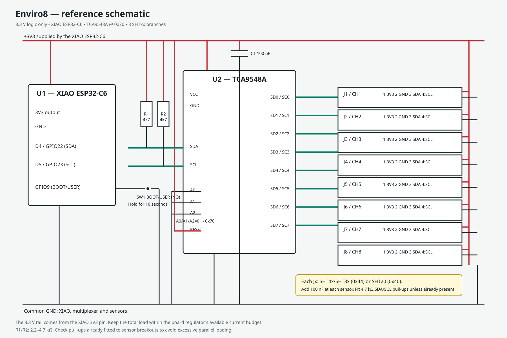

# Enviro8

Enviro8 is a production-oriented, eight-channel temperature and humidity gateway built around the Seeed Studio XIAO ESP32-C6 and a TCA9548A I²C multiplexer. It supports Sensirion SHT4x, SHT3x, and SHT2x sensors, provides automatic family detection, per-channel calibration, persistent configuration, a browser-based dashboard, and a versioned JSON REST API.

The firmware is designed for installations where several sensors share the same I²C address. Each sensor is isolated on its own TCA9548A channel and polled by a FreeRTOS task. The latest measurements and operational counters remain available from the web interface without blocking on sensor transactions.





## Hardware

Diagrams: [wiring block diagram](docs/block-diagram.svg) and [reference schematic](docs/schematic.svg).

| Signal | Default GPIO |
|---|---:|
| I²C SDA | D4 / GPIO22 |
| I²C SCL | D5 / GPIO23 |
| BOOT/USER button (active low) | GPIO9 |
| TCA9548A address | `0x70` |

The firmware enables the ESP32-C6 internal I²C pull-ups, but these are too weak to replace external bus pull-ups in a production design. Use one pair on the upstream SDA/SCL bus and one pair on every populated downstream channel. A good default is 4.7 kΩ from SDA to 3.3 V and 4.7 kΩ from SCL to 3.3 V. For long or highly capacitive wiring, 2.2 kΩ may be appropriate. Do not add another pair when a sensor breakout already includes suitable pull-ups. Connect one sensor to each mux channel. SHT4x/SHT3x use address `0x44`; SHT20 uses `0x40`. Do not expose ESP32-C6 pins to 5 V.

The TCA9548A and all sensors are powered directly from the XIAO ESP32-C6 `3V3` pin. Connect the XIAO ground, mux ground, and every sensor ground together. Never connect 5 V directly to the 3.3 V rail or any GPIO. Verify that the total load remains within the XIAO board regulator's available current budget.

> GPIO9 is the XIAO BOOT button and an ESP32-C6 strapping pin. To request a factory reset, press and hold it for ten seconds after the firmware has booted. Holding it while powering or resetting the board can enter the ROM bootloader.

## First boot and network setup

With no stored SSID, the device starts WPA2 access point **Enviro8-Setup**, password **configureme**, at `http://192.168.4.1`. Configure station Wi-Fi and either DHCP or a static IPv4 address, save, and reboot. Holding USER low continuously for 10 seconds erases the application NVS namespace and restarts in setup-AP mode.

Network changes are persisted immediately and applied after reboot. Channel changes apply to subsequent polls. Passwords are write-only in the API and are never returned. For deployment, change the factory AP password and consider adding API authentication/TLS appropriate to the threat model.

## Sensor behavior

- `Auto` probes SHT4x, then SHT3x, then SHT2x and reports a family because Sensirion measurement protocols generally cannot prove an exact marketing model.
- Explicit models select the corresponding family driver. SHT45/SHT41/SHT40 map to SHT4x; SHT35/SHT31/SHT30 map to SHT3x; SHT20 maps to SHT2x.
- `Other` is retained as configuration but has no generic measurement protocol, so it remains offline until a custom driver is added.
- Each channel is selected exclusively through the TCA9548A. Readings are sampled about every five seconds and cached under a mutex.
- SHT4x serial numbers are exposed when the serial command succeeds. Families without a consistently supported serial operation return `null`.

## REST API

All responses are JSON. Temperature is °C, humidity is %RH, offsets use the same units, and `lastReadMs` is monotonic milliseconds since boot.

| Method | Endpoint | Purpose |
|---|---|---|
| GET | `/api/v1/sensors` | all cached readings |
| GET | `/api/v1/sensors/{channel}` | one reading, channel 1–8 |
| GET | `/api/v1/status` | firmware, uptime, mode, RSSI |
| GET | `/api/v1/config` | network (without password) and channel config |
| PUT | `/api/v1/config/network` | update Wi-Fi and IPv4 config |
| PUT | `/api/v1/config/channels` | update channel types and offsets |
| POST | `/api/v1/sensors/detect` | request detection on next poll |
| POST | `/api/v1/reboot` | reboot |
| POST | `/api/v1/factory-reset` | erase config and reboot |

Example channel update:

```json
{"channels":[{"channel":1,"type":"SHT45","temperatureOffset":-0.25,"humidityOffset":1.2}]}
```

Example network update:

```json
{"ssid":"Lab","password":"secret","dhcp":false,"ip":"192.168.1.50","gateway":"192.168.1.1","netmask":"255.255.255.0","dns":"8.8.8.8"}
```

## Build and flash

Install ESP-IDF 6.x, activate its environment, then:

```sh
idf.py set-target esp32c6
idf.py build
idf.py -p COM5 flash monitor
```

The component manifest requires ESP-IDF 5.5 or later and the source uses the current `i2c_master` APIs, so it can also be compiled with 5.5 for transition testing. The custom 4 MB partition table allocates a 1.5 MB factory app and preserves ample space for later storage use.

## Project structure

- `app_config.*` — defaults, NVS serialization, channel type mapping
- `network.*` — setup AP, DHCP/static station configuration, RSSI
- `sensor_manager.*` — TCA9548A and SHT4x/SHT3x/SHT2x protocols, polling/cache
- `web_server.*` — embedded HTTP server and REST API
- `www/index.html` — dependency-free responsive UI embedded in firmware
- `app_main.c` — lifecycle and 10-second hardware reset gesture

## License

Enviro8 is open-source software released under the [MIT License](LICENSE). You may use, copy, modify, merge, publish, distribute, sublicense, and sell copies of the software subject to the terms of that license.

## Production notes

NVS blob compatibility currently follows the `app_config_t` layout. Add a schema version and migration before changing that layout in shipped products. Static IPv4 strings should be validated more strictly before accepting untrusted clients. Device-specific authentication, secure boot, flash encryption, OTA slots, HTTPS, and per-device AP credentials are intentionally deployment decisions rather than hard-coded assumptions.
